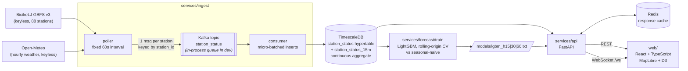

# UrbanPulse — Real-Time Mobility Analytics Platform


Full-stack streaming platform forecasting bike-share station availability in Ljubljana.
- Built an ingestion pipeline consuming public station APIs on a fixed polling interval via Kafka, persisting observations in TimescaleDB with continuous aggregates.
- Trained a gradient-boosted forecasting model (LightGBM) on weather and calendar features, benchmarked against a seasonal naive baseline with rolling-origin cross-validation.
- Exposed predictions through a FastAPI service with Redis caching and WebSocket push for live dashboard updates, load-tested with Locust.
- Developed a React + TypeScript dashboard with MapLibre heatmaps and D3 time-series charts, supporting station-level drill-down and historical replay.
- Containerized the stack with Docker Compose and automated testing and deployment through GitHub Actions CI/CD.

## Status

- **Fully implemented and running locally:** GBFS v3 ingestion (poller -> bus -> consumer -> store), versioned migrations for both backends, the 15-minute continuous aggregate, LightGBM training with rolling-origin CV, the FastAPI service (`/stations`, `/stations/{id}/history`, `/predict/{id}`, `/replay`, `/metrics/cache`, `/ws`), and the React + TypeScript dashboard (map, station drill-down, historical replay).
- **Training data is synthetic-backfilled.** GBFS publishes only the present moment, so a fresh clone has no history. `scripts/seed_history.py` generates 28 days of plausible availability from **real** station metadata and **real** Open-Meteo weather; only the bike counts are simulated. Every model number below is measured on that synthetic history and is therefore an optimistic bound on real-world skill. Run `make ingest` to accumulate genuine observations instead.
- **Every number in `## Results` was measured by running the code** on this machine and the raw output is committed under `results/`. Nothing is estimated.
- **Redis was not available locally**, so the cache hit rate was measured with the in-process cache backend. It shares the exact `Cache.fetch` accounting path and TTLs with the Redis backend; only the storage differs. The Redis figure can only be produced under the container stack.
- **The `stack` CI job has never been verified.** Docker is not installed on the development machine, so `docker compose up` was never executed. That job is written defensively (pinned tags, a healthcheck on every service, a 420 s `--wait-timeout`, log dumps on failure) but it is unproven — check it first on a red run.
- **Deliberately out of scope for the MVP:** authentication, Kubernetes, alerting, model retraining schedules, multi-city support, and per-station embeddings in the model.

## Quickstart

Two ways to run it. The local path needs **no Docker** and is the one that was verified end to end.

### Local (SQLite + in-process queue)

```bash
git clone <this-repo> && cd urbanpulse
make install                 # venv + python deps
make seed                    # 28 days of history: real stations, real weather, synthetic counts
make train                   # LightGBM + rolling-origin CV -> results/cv_metrics.json
make api                     # http://127.0.0.1:8000  (docs at /docs)

# in a second terminal
make web-install && make web-dev     # http://localhost:5173
```

Everything that can be checked without Docker:

```bash
make verify        # ruff + mypy + pytest + eslint + tsc + vite build
make loadtest      # Locust against the running API -> results/locust_*.csv
make cache-report  # cache hit rate -> results/cache_hitrate.json
```

To ingest the **real** live feed instead of the synthetic backfill:

```bash
make ingest        # polls BicikeLJ GBFS every 60 s into the local store
```

### Container stack (Kafka + TimescaleDB + Redis)

```bash
cp .env.example .env
docker compose up -d --build --wait     # api :8000, dashboard :8080
curl -fsS http://localhost:8000/health
docker compose down -v
```

`URBANPULSE_BACKEND` selects the implementation: `sqlite` swaps in a SQLite file and an
in-process queue, `timescale` swaps in TimescaleDB and Kafka. The storage and bus ports
(`services/common/storage/base.py`, `services/common/bus/base.py`) are the seam.

## Architecture



## Results

All figures below come from committed artefacts in `results/` and are reproducible with the
commands in `## Quickstart`.

### Forecast accuracy vs. seasonal-naive baseline

4-fold rolling-origin cross-validation (expanding train window, sliding test window, a
horizon-sized gap between them so no training target overlaps a test period). 88 stations,
236,632 fifteen-minute buckets, 30 features, ~141,800 test rows per horizon. The baseline is
the value observed at the same time of day one week earlier, scored on identical rows.
Source: [`results/cv_metrics.json`](results/cv_metrics.json), per-fold detail in
[`results/cv_folds.csv`](results/cv_folds.csv).

| Horizon | LightGBM MAE | Naive MAE | MAE reduction | LightGBM RMSE | Naive RMSE | RMSE reduction |
|---------|-------------:|----------:|--------------:|--------------:|-----------:|---------------:|
| +15 min | **0.322** | 0.984 | **67.2%** | **0.484** | 1.259 | **61.6%** |
| +30 min | **0.460** | 0.984 | **53.2%** | **0.664** | 1.259 | **47.2%** |
| +60 min | **0.617** | 0.984 | **37.3%** | **0.874** | 1.259 | **30.6%** |

Errors are in bikes. Skill decays with horizon as expected. Training all three horizons plus
the 12 CV fits took 86.5 s.

### API load test

Locust, 50 concurrent users, 10/s spawn rate, 60 s, against a single `uvicorn` worker on the
SQLite backend (Darwin arm64, Python 3.11.0). Source:
[`results/locust_stats.csv`](results/locust_stats.csv) and
[`results/locust_run.json`](results/locust_run.json).

| Metric | Value |
|--------|------:|
| Requests | 9,307 |
| Failures | 0 |
| Throughput | 157.4 req/s |
| Latency p50 | 1 ms |
| Latency p95 | 29 ms |
| Latency p99 | 51 ms |
| Latency max | 130.2 ms |

Per endpoint:

| Endpoint | req/s | p50 | p95 |
|----------|------:|----:|----:|
| `/stations` | 68.5 | 1 ms | 3 ms |
| `/predict/{id}` | 34.9 | 1 ms | 4 ms |
| `/stations/{id}/history` | 34.1 | 1 ms | 3 ms |
| `/replay` | 13.7 | 21 ms | 53 ms |
| `/health` | 6.2 | 26 ms | 54 ms |

`/replay` and `/health` are the slow pair, and for a known reason: both scan across all 709,720
raw observations (a per-station `MAX(ts) <= t` and a `MIN/MAX(ts)`), and the SQLite dev backend
serialises every query on one connection lock. Under TimescaleDB these become chunk-local scans.

### Cache

TTLs are per endpoint and set in `.env.example`: 15 s for `/stations` (the map polls it),
60 s for `/stations/{id}/history` and `/predict/{id}`, 300 s for `/replay`. Cache keys for
history, predictions and replay are additionally bucketed to 15 minutes, so a key changes only
when a new aggregate bucket opens. Source: [`results/cache_hitrate.json`](results/cache_hitrate.json).

| Metric | Value |
|--------|------:|
| Requests | 600 |
| Hits | 523 |
| Misses | 77 |
| **Hit rate** | **87.2%** |
| Backend measured | in-process (Redis unavailable locally — see `## Status`) |

### Test and code size

| | |
|---|---:|
| Tests | 39 passing (`pytest`) |
| `ruff` / `mypy` / `eslint` / `tsc` | clean |
| Python (`services/`) | 2,528 lines |
| Python (`tests/`, `scripts/`) | 1,052 lines |
| TypeScript + CSS (`web/src/`) | 1,090 lines |
| SQL migrations | 114 lines |
| Ops (compose, CI, Dockerfiles, Makefile) | 589 lines |

## Project structure

```
urbanpulse/
├── migrations/
│   ├── timescale/            # hypertable + the one continuous aggregate (15-min buckets)
│   └── sqlite/               # same schema, aggregate as a plain view — dev parity
├── services/
│   ├── common/
│   │   ├── config.py         # env-driven settings, one switch for the whole backend
│   │   ├── models.py         # Station / Observation / WeatherPoint / prediction DTOs
│   │   ├── gbfs.py           # GBFS v3 client (localised names, RFC3339 + epoch stamps)
│   │   ├── weather.py        # Open-Meteo archive + forecast, stitched on the timestamp
│   │   ├── features.py       # the model matrix; shared by training and serving
│   │   ├── storage/          # Store port + sqlite and timescale adapters
│   │   └── bus/              # Bus port + in-process queue and Kafka adapters
│   ├── ingest/               # poller (producer) and consumer (persistence)
│   ├── forecast/             # LightGBM training, rolling-origin CV, baseline, serving
│   └── api/                  # FastAPI app, response cache, websocket live hub
├── scripts/
│   ├── seed_history.py       # synthetic backfill on real stations + real weather
│   ├── measure_cache.py      # drives traffic, reads the API's own counters
│   └── run_locust.sh         # load test + run metadata
├── web/                      # Vite + React + TypeScript dashboard
│   ├── public/osm-style.json # keyless MapLibre style over OSM raster tiles
│   └── src/components/       # MapView (heatmap), StationPanel (D3), ReplayBar
├── tests/                    # 39 tests, all on the no-Docker backend
├── results/                  # committed measurements backing every number above
├── locustfile.py
├── docker-compose.yml        # kafka (KRaft) · timescaledb · redis · api · ingest · web
└── .github/workflows/ci.yml  # backend · frontend · stack
```

## References

- **GBFS v3.0 specification** — General Bikeshare Feed Specification, MobilityData.
  <https://gbfs.org/specification/reference/>
- **BicikeLJ feed** (JCDecaux Cyclocity, keyless):
  <https://api.cyclocity.fr/contracts/ljubljana/gbfs/v3/gbfs.json>
- **Open-Meteo** — free weather API, historical archive and forecast.
  <https://open-meteo.com/en/docs> · <https://open-meteo.com/en/docs/historical-weather-api>
- **TimescaleDB continuous aggregates** — incremental materialisation over hypertables.
  <https://docs.tigerdata.com/use-timescale/latest/continuous-aggregates/>
- **Ke et al. (2017), _LightGBM: A Highly Efficient Gradient Boosting Decision Tree_**, NeurIPS 30.
  <https://papers.nips.cc/paper_files/paper/2017/hash/6449f44a102fde848669bdd9eb6b76fa-Abstract.html>
- **Bergmeir & Benítez (2012), _On the use of cross-validation for time series predictor evaluation_**,
  Information Sciences 191, 192–213 — the basis for rolling-origin evaluation.
  <https://doi.org/10.1016/j.ins.2011.12.028>
- **Hyndman & Athanasopoulos, _Forecasting: Principles and Practice_ (3rd ed.)** — seasonal-naive
  baseline and time-series cross-validation. <https://otexts.com/fpp3/>
- **MapLibre GL JS style specification** — <https://maplibre.org/maplibre-style-spec/>
- **OpenStreetMap tile usage policy** — the dashboard's raster tiles.
  <https://operations.osmfoundation.org/policies/tiles/>
- **Kafka in KRaft mode** — running a single-node broker without ZooKeeper.
  <https://kafka.apache.org/documentation/#kraft>

## License

MIT — see [LICENSE](LICENSE).
